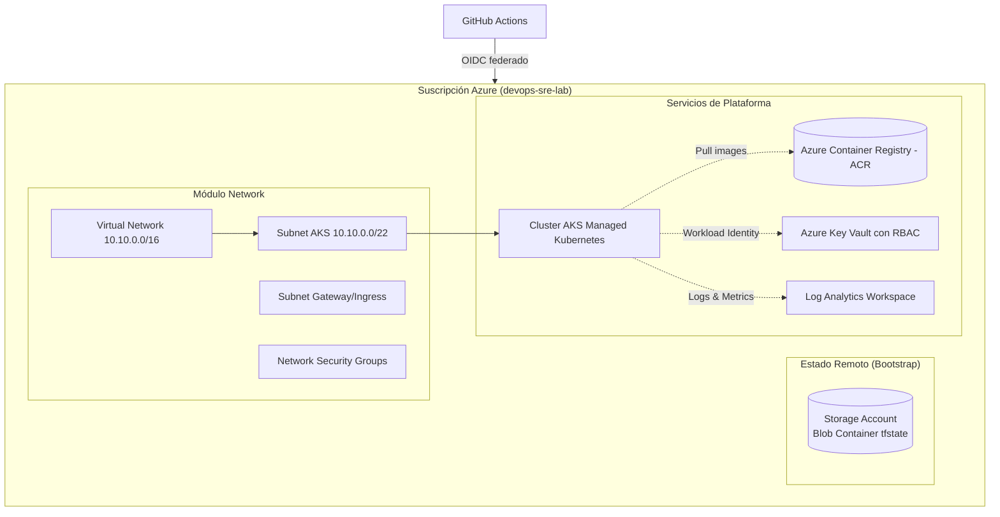

# infra-azure-terraform — Infraestructura como código en Azure

> Estado: 🟨 en curso · Parte del laboratorio [devops-sre-lab](../README.md)

Repositorio de Infraestructura como Código (IaC) para aprovisionar y operar una plataforma de producción en **Microsoft Azure** utilizando **Terraform**. Contiene módulos reutilizables, separación de entornos (`dev` / `prod`), backend remoto con bloqueo de estado y controles de calidad con `pre-commit`, `tflint` y `gitleaks`.

---

## 1. Arquitectura de Infraestructura



---

## 2. Estructura del Repositorio

La arquitectura sigue el patrón de **Módulos Reutilizables + Entornos Componibles**:

```text
infra-azure-terraform/
├── Makefile                      # Punto de entrada estandarizado (doctor, fmt, validate, plan, apply)
├── README.md                     # Documentación principal del proyecto
├── .gitignore                    # Reglas para tfstate, tfvars y binarios temporales
├── .pre-commit-config.yaml       # Hooks de git: terraform_fmt, gitleaks, YAML linter
├── .tflint.hcl                   # Reglas de linting específicas para Terraform y AzureRM
├── bootstrap/                    # Aprovisionamiento del Storage Account para tfstate remoto
│   ├── main.tf
│   ├── variables.tf
│   ├── outputs.tf
│   └── versions.tf
├── envs/                         # Entornos que consumen los módulos
│   ├── dev/                      # Entorno de desarrollo (recursos ajustados para bajo costo)
│   │   ├── main.tf
│   │   ├── variables.tf
│   │   ├── outputs.tf
│   │   ├── versions.tf
│   │   └── terraform.tfvars.example
│   └── prod/                     # Entorno de producción (alta disponibilidad)
│       ├── main.tf
│       ├── variables.tf
│       ├── outputs.tf
│       ├── versions.tf
│       └── terraform.tfvars.example
├── modules/                      # Módulos propios e independientes
│   ├── network/                  # VNet, Subnets y NSGs
│   ├── aks/                      # Cluster AKS y Node Pools
│   ├── acr/                      # Container Registry con admin deshabilitado
│   ├── keyvault/                 # Key Vault con RBAC habilitado
│   └── monitoring/               # Log Analytics Workspace y alertas
├── docs/                         # Documentación detallada y diagramas
└── scripts/
    └── install-tools.sh          # Instalación idempotente de herramientas locales
```

---

## 3. Prerrequisitos y Verificación

Para ejecutar y colaborar en este repositorio se requiere:
* **Terraform** (`>= 1.8.0`)
* **Azure CLI** (`az`) autenticado con la suscripción activa
* **tflint**, **gitleaks** y **pre-commit**

Verifica tu entorno con:
```bash
make doctor
```

Para instalar las herramientas que falten automáticamente:
```bash
make tools
```

---

## 4. Comandos Disponibles (`Makefile`)

| Comando | Descripción |
|---|---|
| `make doctor` | Verifica el estado de las herramientas locales y la suscripción activa |
| `make fmt` | Formatea recursivamente todos los archivos de Terraform |
| `make fmt-check` | Valida que el formato cumpla con el estándar sin modificar archivos |
| `make lint` | Ejecuta los hooks de `pre-commit` sobre todos los archivos del repositorio |
| `make tflint` | Ejecuta análisis estático y buenas prácticas con `tflint` |
| `make init ENV=dev` | Inicializa el entorno especificado (`bootstrap`, `dev`, `prod`) |
| `make plan ENV=dev` | Genera el plan de ejecución de Terraform para el entorno indicado |
| `make apply ENV=dev` | Aplica los cambios de infraestructura en el entorno seleccionado |
| `make destroy ENV=dev` | Destruye los recursos del entorno para evitar sobrecostos |

---

## 5. Documentación de Arquitectura y Guías

* [Autenticación OIDC con GitHub Actions](docs/oidc.md) · Federación de identidades sin secretos estáticos (Workload Identity Federation).
* [Backend Remoto y Bloqueo de Estado](docs/backend-remote-locking.md) · Azure Blob Storage con state locking para Terraform.
* [Módulo de Redes](docs/network.md) · Topología de VNet, subnets y NSG para AKS.
* [Módulo AKS y Workload Identity](docs/aks.md) · Cluster AKS con Azure CNI Overlay, Cilium eBPF y autoscaler.
* [Ciclo de Vida del Entorno Dev](docs/dev-environment-lifecycle.md) · Pruebas de extremo a extremo, despliegue de Online Boutique y drift detection.

---

## 6. Control de Costos y Buenas Prácticas FinOps

* **Destrucción al terminar la sesión:** La infraestructura de laboratorio en la nube no debe quedar encendida permanentemente; ejecutar `make destroy ENV=dev` al finalizar cada sesión de trabajo.
* **Presupuesto activo:** La suscripción cuenta con un Azure Budget mensual de $20 USD con notificaciones automáticas al 50%, 80% y 100%.
