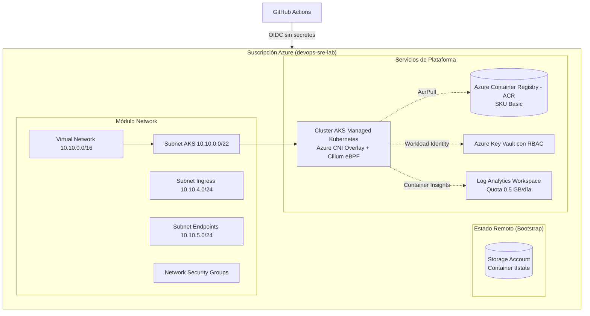

# infra-azure-terraform — Infraestructura como Código en Azure

> **Estado:** ✅ Terminado · Parte del laboratorio [devops-sre-lab](../../README.md)

---

## 1. Qué Problema Resuelve

Aprovisiona y opera una plataforma de contenedores de nivel de producción en **Microsoft Azure** utilizando **Terraform**, resolviendo la necesidad de desplegar infraestructura escalable y resiliente sin incurrir en deudas técnicas de seguridad ni sobrecostos descontrolados.

Garantiza:
* **Seguridad Zero Secrets:** Autenticación federada OIDC (Workload Identity Federation) sin credenciales estáticas ni secretos de larga duración.
* **FinOps Shift-Left:** Estimación y bloqueo de sobrecostos en cada Pull Request mediante Infracost, adaptado al presupuesto estricto de **$20 USD/mes**.
* **Kubernetes de Alto Rendimiento:** AKS con Azure CNI Overlay, Cilium eBPF como plano de datos y políticas de red, y autoescalado dinámico de nodos.
* **Flujo GitOps Confiable:** Pipeline de PR con análisis estático (`tflint`), escaneo de seguridad (`checkov`), plan interactivo y compuerta de aprobación manual antes de aplicar cambios a `dev`.

---

## 2. Arquitectura del Sistema

### 2.1. Arquitectura de Infraestructura en Azure



### 2.2. Flujo del Pipeline de CI/CD

```mermaid
flowchart TD
  subgraph PR["1. Flujo de Pull Request (pr.yaml)"]
    DEV[Developer abre/actualiza PR] --> CHECK[Pre-commit / Linters]
    CHECK --> FMT[terraform fmt -check]
    FMT --> TFLINT[TFLint recursive]
    TFLINT --> CHECKOV[Checkov IaC Scan]
    CHECKOV --> OIDC_PR[Azure Login via OIDC]
    OIDC_PR --> PLAN[terraform plan dev]
    PLAN --> COMMENT[Publica / Actualiza Sticky Comment en PR]
    DEV --> INFRACOST[Infracost breakdown & diff]
    INFRACOST --> COST_COMMENT[Publica diff de costo en PR]
  end

  subgraph CD["2. Flujo de Despliegue en main (apply.yaml)"]
    MERGE[Merge PR a main] --> PLAN_CD[terraform plan -out=tfplan]
    PLAN_CD --> ARTIFACT[Upload Artifact: dev-tfplan]
    ARTIFACT --> GATE{Compuerta Manual:<br/>Environment dev}
    GATE -->|Aprobado por Reviewer| APPLY[terraform apply tfplan]
    GATE -->|Rechazado / Pendiente| STOP[Bloqueado sin cambios]
  end

  subgraph TEARDOWN["3. Flujo de Destrucción (destroy.yaml)"]
    MANUAL[Workflow Dispatch con confirmación 'DESTROY'] --> TEARDOWN_APPLY[terraform destroy -auto-approve]
  end
```



---

## 3. Cómo Ejecutarlo

### 3.1. Prerrequisitos

* **Terraform** (`>= 1.8.0`)
* **Azure CLI** (`az`) autenticado con la suscripción activa
* **tflint**, **gitleaks**, **checkov**, **infracost** y **pre-commit**
* **kubectl** y **helm** (para pruebas de carga sobre AKS)

Verifica y prepara tu entorno local con:
```bash
make doctor  # Valida herramientas y cuenta activa de Azure
make tools   # Instala automáticamente tflint, gitleaks, pre-commit e infracost
```

### 3.2. Comandos Disponibles (`Makefile`)

| Comando | Descripción |
|---|---|
| `make doctor` | Verifica el estado de las herramientas locales y la suscripción activa de Azure |
| `make tools` | Instala de forma idempotente las herramientas de calidad en `~/.local/bin` |
| `make fmt` | Formatea recursivamente todos los archivos de Terraform |
| `make fmt-check` | Valida que el formato cumpla con el estándar sin modificar archivos |
| `make lint` | Ejecuta los hooks de `pre-commit` sobre todos los archivos del repositorio |
| `make tflint` | Ejecuta análisis estático y buenas prácticas con `tflint` de forma recursiva |
| `make init ENV=dev` | Inicializa el entorno especificado (`bootstrap`, `dev`, `prod`) |
| `make plan ENV=dev` | Genera el plan de ejecución de Terraform para el entorno indicado |
| `make apply ENV=dev` | Aplica los cambios de infraestructura en el entorno seleccionado |
| `make destroy ENV=dev` | Destruye los recursos del entorno para mantener el principio de quema cero |

### 3.3. Despliegue Paso a Paso

1. **Bootstrap inicial (una sola vez por suscripción):**
   ```bash
   make init ENV=bootstrap
   make apply ENV=bootstrap
   ```
   Aprovisiona el Resource Group `rg-devops-sre-tfstate`, el Storage Account y registra las credenciales OIDC en Microsoft Entra ID.

2. **Despliegue del entorno Dev:**
   ```bash
   make init ENV=dev
   make plan ENV=dev
   make apply ENV=dev
   ```

3. **Destrucción al terminar la sesión (FinOps):**
   ```bash
   make destroy ENV=dev
   ```

---

## 4. Evidencia y Pruebas Realizadas

### 4.1. Pull Requests y Pipelines Verificados

* **[PR #1](https://github.com/miguelortiz13/infra-azure-terraform/pull/1) — Pipeline de PR y Sticky Comment:**
  * Validó `terraform fmt`, `tflint`, `checkov` y generación de plan mediante OIDC.
  * Publicó el comentario interactivo con tabla de estados y plan desplegable.
  * Demostró actualización *in-place* del comentario tras un segundo commit en la misma rama.
* **[PR #2](https://github.com/miguelortiz13/infra-azure-terraform/pull/2) — FinOps Shift-Left con Infracost:**
  * Detección automática de aumento de costos de **+$67 USD/mes (+83%)** al escalar `vm_size` de `Standard_D2as_v6` a `Standard_D4as_v6`.
  * Publicación del informe de costos interactivo en el PR.
  * Actualización *in-place* al restaurar el tamaño base a `$0 diff`.
* **Compuerta de Aprobación Manual:**
  * Se verificó que el workflow `apply.yaml` queda bloqueado en estado `waiting` bajo el ambiente `dev` requiriendo aprobación explícita de `miguelortiz13`.

### 4.2. Ciclo de Vida Completo y Autoescalado de AKS

Durante la sesión de prueba de extremo a extremo documentada en [`docs/dev-environment-lifecycle.md`](docs/dev-environment-lifecycle.md):
1. **Despliegue de Infraestructura:** 19 recursos creados en 6m 11s.
2. **Carga de Microservicios:** Despliegue de los 12 servicios de Google Online Boutique mediante Helm.
3. **Prueba de Autoescalado:** El Cluster Autoscaler escaló automáticamente el pool de 1 a 3 nodos ante la saturación de CPU del generador de carga:
   ```text
   NAME                                STATUS   ROLES   AGE     VERSION
   aks-devops-sre-dev-vmss000000       Ready    <none>  10m     v1.30.9
   aks-devops-sre-dev-vmss000001       Ready    <none>  3m45s   v1.30.9
   aks-devops-sre-dev-vmss000002       Ready    <none>  2m10s   v1.30.9
   ```
4. **Smoke Test:** Frontend respondiendo HTTP 200 de forma estable.
5. **Drift Detection:** Plan detectó con precisión cambios manuales en etiquetas fuera de Terraform.
6. **Teardown Limpio:** 19 recursos destruidos en 5m 30s sin dejar recursos huérfanos en Azure.

---

## 5. Decisiones de Arquitectura y Trade-offs (ADRs)

| ADR | Decisión | Alternativas Descartadas | Justificación y Trade-off |
|---|---|---|---|
| [**ADR-0001**](docs/adr/0001-azure-cni-overlay-cilium.md) | **Azure CNI Overlay + Cilium eBPF** | Kubenet, Azure CNI Clásico | Ahorro masivo de IPs en VNet; enrutamiento a nivel de kernel eBPF sin degradación de `iptables`. |
| [**ADR-0002**](docs/adr/0002-oidc-workload-identity-federation.md) | **OIDC con Identidad Federada** | Client Secret estático, Certificados X.509 | Cero secretos en GitHub; tokens efímeros de 1 hora; eliminación de tareas de rotación manual. |
| [**ADR-0003**](docs/adr/0003-estructura-modulos-entornos-backend-remoto.md) | **Módulos desacoplados + `envs/` + Blob Leases** | Monolito `main.tf`, Workspaces | Separación de blast radius; bloqueo de concurrencia distribuido nativo en Azure Blob Storage. |

Otras guías de arquitectura disponibles:
* [FinOps Shift-Left con Infracost](docs/infracost.md)
* [Pipeline de CI/CD: Validación, Seguridad y Plan](docs/ci-cd.md)
* [Autenticación OIDC con GitHub Actions](docs/oidc.md)
* [Backend Remoto y Bloqueo de Estado](docs/backend-remote-locking.md)
* [Módulo de Redes](docs/network.md)
* [Módulo AKS y Workload Identity](docs/aks.md)
* [Ciclo de Vida del Entorno Dev](docs/dev-environment-lifecycle.md)

---

## 6. Qué Aprendí y Qué Haría Distinto

### 6.1. Lecciones Aprendidas

1. **Disponibilidad de Familias de VM en Azure:** La serie `Standard_B2s` no contaba con cuota en `eastus2`. Se seleccionó la serie moderna `Standard_D2as_v6` (AMD EPYC, 2 vCPUs, 8 GiB RAM), que ofrece un balance óptimo de costo/rendimiento y cuota disponible.
2. **Dimensionamiento de Disco para Evitar Eviction:** Con discos de SO de 30 GB, la descarga simultánea de imágenes pesadas de Kubernetes y observabilidad provocaba uso de disco superior al 85%, disparando el desalojo de Pods por falta de almacenamiento efímero. Se ajustó el valor por defecto a `64 GB`.
3. **Drift Detection en Cluster Autoscaler:** Cuando el autoscaler modifica dinámicamente el número de nodos, Terraform detecta drift si `node_count` está definido en el bloque. Se mitigó configurando `lifecycle { ignore_changes = [default_node_pool[0].node_count] }`.
4. **Formato Inmutable de GitHub Actions OIDC:** GitHub introdujo identificadores inmutables con `@<id>` (`repo:miguelortiz13@89714460/...`). Adaptar las credenciales federadas a este estándar resolvió el error `AADSTS700213`.
5. **Autenticación OIDC para Terraform:** El proveedor y backend `azurerm` en GitHub Actions no utilizan la sesión de Service Principal de Azure CLI, sino que requieren variables nativas de entorno (`ARM_USE_OIDC=true`, `ARM_USE_AZUREAD=true`).

### 6.2. Costo Real Gastado y FinOps

* **Presupuesto Asignado:** $20.00 USD/mes con Azure Budget y alertas automáticas al 50%, 80% y 100%.
* **Gasto Real Acumulado:** Menos de **$1.50 USD** durante todo el desarrollo y pruebas de P1 gracias a la disciplina de teardown sistemático.
* **Burn Rate Actual:** **$0.00 USD/hora** (únicamente el Storage Account de tfstate permanece en Azure en reposo).

### 6.3. Qué Haría Distinto

* Para un entorno empresarial de producción, implementaría **Private Clusters de AKS** combinados con **Azure Bastion** o agentes autohospedados en la VNet para eliminar cualquier exposición pública del API Server de Kubernetes.
* Integraría **Infracost Cloud** para seguimiento continuo de presupuestos organizacionales en lugar de ejecuciones exclusivamente locales/CLI.
