# Pipeline de CI/CD: Validación, Seguridad, Plan y Despliegue Controlado

> Documentación de arquitectura de integración continua y despliegue continuo para [infra-azure-terraform](../README.md).

---

## 1. Visión General de la Arquitectura CI/CD

El repositorio implementa un flujo GitOps robusto y seguro basado en **GitHub Actions** y **Workload Identity Federation (OIDC)** con Azure:

```mermaid
flowchart TD
  subgraph PR["1. Flujo de Pull Request (pr.yaml)"]
    DEV[Developer abre/actualiza PR] --> CHECK[Pre-commit / Linters]
    CHECK --> FMT[terraform fmt -check]
    FMT --> TFLINT[TFLint recursive]
    TFLINT --> CHECKOV[Checkov IaC Scan]
    CHECKOV --> OIDC_PR[Azure Login via OIDC]
    OIDC_PR --> PLAN[terraform plan dev]
    PLAN --> COMMENT[Publica / Actualiza Sticky Comment en PR]
  end

  subgraph CD["2. Flujo de Despliegue en main (apply.yaml)"]
    MERGE[Merge PR a main] --> PLAN_CD[terraform plan -out=tfplan]
    PLAN_CD --> ARTIFACT[Upload Artifact: dev-tfplan]
    ARTIFACT --> GATE{Compuerta Manual:<br/>Environment dev}
    GATE -->|Aprobado por Reviewer| APPLY[terraform apply tfplan]
    GATE -->|Rechazado / Pendiente| STOP[Bloqueado sin cambios]
  end

  subgraph TEARDOWN["3. Flujo de Destrucción (destroy.yaml)"]
    MANUAL[Workflow Dispatch con confirmación 'DESTROY'] --> TEARDOWN_APPLY[terraform destroy -auto-approve]
  end
```

---

## 2. Etapas del Pipeline de Pull Request (`pr.yaml`)

Cada Pull Request hacia la rama `main` activa automáticamente el workflow de validación.

### 2.1. Controles de Calidad y Seguridad
1. **Formato (`terraform fmt`):** Verifica que todo el código cumpla con los estándares de estilo de HashiCorp sin modificar archivos en CI.
2. **Análisis Estático (`tflint`):** Valida sintaxis, variables no utilizadas y buenas prácticas específicas del proveedor `azurerm` usando la configuración centralizada [`.tflint.hcl`](../.tflint.hcl).
3. **Escaneo de Seguridad IaC (`checkov`):**
   * Analiza módulos y entornos contra más de 100 reglas de seguridad de Azure.
   * Utiliza el archivo [`.checkov.yaml`](../.checkov.yaml) en la raíz para centralizar y justificar exclusiones técnicas asociadas a la restricción presupuestaria de FinOps ($20 USD/mes), como SKUs Premium de Container Registry o Private Endpoints para Key Vault en entorno de desarrollo.

### 2.2. Planificación Remota con OIDC
* El runner solicita un token OIDC a GitHub Actions.
* Microsoft Entra ID valida el claim de sujeto `repo:miguelortiz13@89714460/infra-azure-terraform@1384705422:pull_request`.
* Terraform se inicializa contra el backend remoto en Azure Blob Storage (`stdevsretfufbmga`) utilizando variables `ARM_USE_OIDC=true` y `ARM_USE_AZUREAD=true`.
* Se genera el plan de ejecución sin requerir credenciales estáticas ni secretos guardados en GitHub.

### 2.3. Comentario Interactivo en el PR (*Sticky Comment*)
* El script de GitHub Actions busca si ya existe un comentario del bot con el encabezado `### 🪐 Terraform Plan (envs/dev)`.
* Si existe, **lo actualiza in-place** con los resultados del último commit; si no existe, crea un nuevo comentario.
* Muestra una tabla con el estado de cada validación y un bloque desplegable (`
`) con el plan de Terraform completo.

---

## 3. Despliegue Continuo con Compuerta de Aprobación (`apply.yaml`)

El despliegue a la rama `main` sigue el principio de **separación de fases y aprobación manual**:

1. **Fase `plan`:**
   * Ejecuta `terraform plan -out=tfplan`.
   * Guarda el plan compilado como artefacto de GitHub Actions (`dev-tfplan`) con retención de 1 día.
2. **Fase `apply`:**
   * Depende de la finalización exitosa de la fase `plan`.
   * Configura `environment: dev`.
   * **Compuerta de Aprobación (*Required Reviewers*):** GitHub detiene la ejecución y notifica a los revisores asignados (`miguelortiz13`). La fase queda en estado `waiting` hasta la autorización explícita en la interfaz web de GitHub o mediante GitHub CLI/API.
   * **Garantía de idempotencia:** Descarga el artefacto `tfplan` generado en la fase anterior y ejecuta `terraform apply tfplan`, asegurando que se aplique **exactamente** lo que fue planificado y aprobado.

---

## 4. Teardown Seguro y FinOps (`destroy.yaml`)

Para mantener el principio de quema cero ($0.00 USD/hora al terminar la jornada de pruebas):
* Se implementó el workflow `destroy.yaml` invocable vía `workflow_dispatch`.
* Exige escribir la palabra clave `DESTROY` como parámetro de entrada para evitar destrucciones accidentales.
* Se ejecuta bajo el ambiente `dev` registrando la actividad en el historial de despliegues.

---

## 5. Reglas de Protección de Rama (`main`)

Se configuraron las siguientes políticas de gobernanza sobre la rama `main`:

| Regla | Estado | Propósito |
|---|---|---|
| **Pull Request obligatorio** | Activo | Prohíbe pushes directos a `main` sin pasar por revisión de código. |
| **Check Requerido:** `Validation, Security & Plan` | Activo | El PR no puede fusionarse si alguna etapa falla (formato, tflint, checkov o plan). |
| **Ambiente `dev` con Required Reviewer** | Activo (`miguelortiz13`) | Ningún apply en infraestructura se ejecuta automáticamente sin aprobación humana. |

---

## 6. Evidencia de Verificación

* **Pull Request de prueba:** [PR #1](https://github.com/miguelortiz13/infra-azure-terraform/pull/1) (`test(ci): verify PR validation, security checks and terraform plan comment (#20)`).
* **Verificación de Sticky Comment:** Comprobado que tras un segundo commit en la misma rama, el comentario existente se actualizó in-place reflejando el nuevo commit y manteniendo exactamente 1 comentario en el PR.
* **Verificación de Compuerta Apply:** Comprobado que el job `Apply to Dev Environment` queda en estado `waiting` y se expone la acción de aprobación en la API/UI de GitHub (`pending_deployments`).
