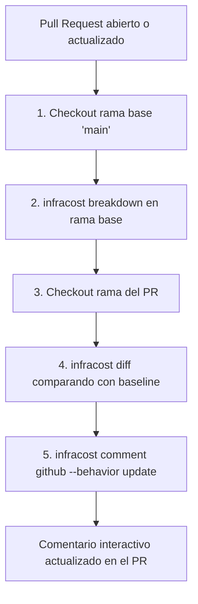

# FinOps Shift-Left: Estimación de Costos en PRs con Infracost

> Documentación de arquitectura de gobernanza de costos y estimación automática para [infra-azure-terraform](../README.md).

---

## 1. Contexto y Motivación: FinOps Shift-Left

En los modelos operativos tradicionales en la nube, el análisis de costos ocurre de forma reactiva (a fin de mes cuando llega la factura o cuando se superan los umbrales de presupuesto).

Con el enfoque **FinOps Shift-Left**:
* ✅ **Visibilidad Temprana:** Los ingenieros conocen el impacto financiero exacto de cada cambio en Terraform **antes** de que el código sea fusionado a `main`.
* ✅ **Prevención de Sobrecostos:** Evita escalar accidentalmente tipos de instancias, discos o servicios que sobrepasen el presupuesto mensual de $20 USD del laboratorio.
* ✅ **Transparencia en Code Review:** Los revisores de PR pueden evaluar tanto la calidad técnica y de seguridad como la viabilidad económica del cambio propuesto.

---

## 2. Flujo de Trabajo en GitHub Actions (`pr.yaml`)

El pipeline ejecuta el job `infracost` en paralelo con `validate-and-plan`:



### 2.1. Configuración del Job

```yaml
  infracost:
    name: Infracost Cost Estimate
    runs-on: ubuntu-latest
    steps:
      - name: Setup Infracost
        uses: infracost/actions/setup@v3
        with:
          api-key: ${{ secrets.INFRACOST_API_KEY }}

      - name: Checkout base branch
        uses: actions/checkout@v4
        with:
          ref: '${{ github.event.pull_request.base.ref }}'

      - name: Generate Infracost cost baseline
        run: |
          infracost breakdown --path=envs/dev \
                              --format=json \
                              --out-file=/tmp/infracost-base.json

      - name: Checkout PR branch
        uses: actions/checkout@v4

      - name: Generate Infracost cost diff
        run: |
          infracost diff --path=envs/dev \
                         --compare-to=/tmp/infracost-base.json \
                         --format=json \
                         --out-file=/tmp/infracost.json

      - name: Post Infracost Comment
        run: |
          infracost comment github \
            --repo "${{ github.repository }}" \
            --pull-request "${{ github.event.pull_request.number }}" \
            --path /tmp/infracost.json \
            --github-token "${{ secrets.GITHUB_TOKEN }}" \
            --behavior update
```

---

## 3. Desglose de Costos de la Infraestructura Base (`envs/dev`)

Ejecutando `infracost breakdown --path=envs/dev` localmente o en CI:

| Recurso | Parámetros | Costo Mensual Estimado |
|---|---|---|
| **AKS Node Pool (`default_node_pool`)** | 1 nodo `Standard_D2as_v6` (2 vCPU, 8 GiB RAM) | $66.28 USD |
| **AKS OS Managed Disk** | 64 GB SSD Administrado (P6, LRS) | $9.28 USD |
| **Azure Container Registry (ACR)** | SKU `Basic` | $5.00 USD |
| **Log Analytics Workspace** | Cuota diaria 0.5 GB / Retención 30 días | Basado en ingesta (~$0.00 en reposo) |
| **Redes, NSG, Subnets, Key Vault** | Recursos estándar sin costo base de cómputo | $0.00 USD |
| **Total Mensual Base en Reposo:** | | **$80.56 USD/mes** |

> [!NOTE]
> Dado que el presupuesto de laboratorio es de $20 USD/mes, la política de FinOps exige destruir el entorno `dev` al finalizar cada sesión de trabajo con `make destroy ENV=dev` o el workflow `destroy.yaml`, manteniendo el costo real de operación por hora en ~$0.11 USD/hora únicamente mientras se realizan pruebas activas.

---

## 4. Evidencia de Verificación y Prueba de Diff

Para validar la detección de cambios de costo se ejecutó el siguiente experimento en el [PR #2](https://github.com/miguelortiz13/infra-azure-terraform/pull/2):

### Experimento 1: Aumento de tamaño de nodo
* **Cambio:** `vm_size = "Standard_D2as_v6"` (2 vCPUs) ➔ `vm_size = "Standard_D4as_v6"` (4 vCPUs).
* **Resultado Infracost:**
  ```markdown
  💰 Infracost report
  Monthly estimate increased by $67 📈 (+83%)

  Changed project: envs/dev
  Baseline cost: +$67
  New monthly cost: $147 USD

  ~ module.aks.azurerm_kubernetes_cluster.aks
    +$67 ($76 → $142)
      ~ default_node_pool
        ~ Instance usage (Linux, pay as you go, Standard_D2as_v6 → Standard_D4as_v6)
          +$67 ($66 → $133)
  ```
* **Comentario en PR:** Publicado automáticamente por el bot de Infracost con tabla y badges de costo.

### Experimento 2: Reversión y actualización del comentario
* **Cambio:** Se restauró `vm_size = "Standard_D2as_v6"`.
* **Resultado:** Infracost detectó la reversión, actualizó el comentario existente *in-place* sin duplicar mensajes y reportó `$0` de incremento mensual.
