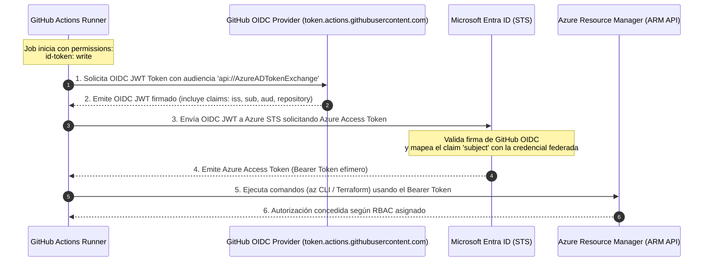

# Autenticación GitHub Actions → Azure con OIDC (Workload Identity Federation)

> Documentación de arquitectura, configuración y verificación de identidad federada sin secretos para [infra-azure-terraform](../README.md).

---

## 1. Contexto y Motivación

Tradicionalmente, la integración de pipelines CI/CD (como GitHub Actions) con proveedores de nube como Azure requería la creación de un **Client Secret** o certificado de larga duración en Microsoft Entra ID (anteriormente Azure AD), almacenado luego en los *GitHub Secrets* del repositorio:

* ❌ **Riesgos de credenciales estáticas:**
  * **Exfiltración y fuga:** Si un secreto se filtra o se expone en logs, el atacante mantiene acceso persistente hasta que el secreto expire o sea revocado.
  * **Mantenimiento y rotación manual:** Los secretos caducan (típicamente a los 6, 12 o 24 meses), requiriendo calendarios de rotación manuales que provocan caídas imprevistas de pipelines si se olvidan.
  * **Superficie de ataque ampliada:** Almacenar secretos en repositorios o herramientas externas duplica la superficie de exposición.

### La solución: OpenID Connect (OIDC) y Workload Identity Federation

Con **OpenID Connect (OIDC)** y **Federación de Identidades para Cargas de Trabajo (Workload Identity Federation)** de Microsoft Entra ID:
* ✅ **Cero Secretos Estáticos:** No se genera ni almacena ninguna contraseña, clave de API ni certificado en GitHub.
* ✅ **Tokens efímeros de corta duración:** El token emitido por Azure tiene una vida útil corta (máximo 1 hora) y se descarta automáticamente al finalizar el job.
* ✅ **Granularidad y Mínimo Privilegio por contexto:** La confianza se establece en función de los *claims* del token emitido por GitHub (rama, pull request, entorno o tag).
* ✅ **Trazabilidad y Auditoría:** Cada solicitud de token queda registrada en los *Sign-in Logs* de Microsoft Entra ID con el nombre del workflow, repositorio y actor.

---

## 2. Flujo de Intercambio de Tokens (Token Exchange)

El siguiente diagrama detalla la secuencia de autenticación entre GitHub Actions y Azure:



---

## 3. Configuración en Microsoft Entra ID y Terraform

La configuración se gestiona como código en [`bootstrap/main.tf`](../bootstrap/main.tf):

### 3.1. Aplicación y Service Principal

```hcl
resource "azuread_application" "github_actions" {
  display_name = var.github_actions_app_name
  owners       = [data.azurerm_client_config.current.object_id]
}

resource "azuread_service_principal" "github_actions" {
  client_id = azuread_application.github_actions.client_id
  owners    = [data.azurerm_client_config.current.object_id]
}
```

### 3.2. Credenciales Federadas (Federated Identity Credentials)

Se definieron tres credenciales federadas para restringir el acceso a contextos autorizados del repositorio.

> [!NOTE]
> GitHub Actions introdujo el formato de sujeto inmutable (*Immutable Subject Format*) para repositorios: `repo:<owner>@<owner_id>/<repo>@<repo_id>:<context>`. Esto asegura que los identificadores de federación permanezcan inmutables ante cambios de nombre de usuario o transferencia de repositorios. Para este proyecto, el prefijo inmutable es `repo:miguelortiz13@89714460/infra-azure-terraform@1384705422`.

* **Emisor (*Issuer*):** `https://token.actions.githubusercontent.com`
* **Audiencia (*Audiences*):** `["api://AzureADTokenExchange"]`

| Nombre Credencial | Subject Claim (`sub`) | Propósito |
|---|---|---|
| `github-actions-branch-main` | `repo:miguelortiz13@89714460/infra-azure-terraform@1384705422:ref:refs/heads/main` | Ejecuciones originadas en commits a la rama `main` (despliegue continuo). |
| `github-actions-pull-request` | `repo:miguelortiz13@89714460/infra-azure-terraform@1384705422:pull_request` | Validación de PRs (ejecución de `terraform plan` y linters). |
| `github-actions-env-dev` | `repo:miguelortiz13@89714460/infra-azure-terraform@1384705422:environment:dev` | Trabajos dirigidos al entorno `dev` de GitHub Actions. |

### 3.3. Asignación de Roles RBAC (Mínimo Privilegio)

El Service Principal recibe tres roles estrictamente necesarios para la gestión de infraestructura con Terraform:

1. **`Contributor` en la suscripción:** Permite crear, modificar y destruir recursos de infraestructura (VNet, AKS, Log Analytics, ACR, etc.).
2. **`Storage Blob Data Contributor` en el Storage Account del estado remoto (`stdevsretfufbmga`):** Permite leer, escribir y bloquear (`lease`) los archivos de estado `dev.tfstate` y `prod.tfstate` mediante autenticación Entra ID sin claves de acceso.
3. **`User Access Administrator` en la suscripción:** Permite que Terraform cree las asignaciones de roles requeridas por la infraestructura (por ejemplo, el rol `AcrPull` de la identidad del Kubelet de AKS sobre el Azure Container Registry).

---

## 4. Configuración en GitHub

Dado que la arquitectura OIDC no utiliza secretos estáticos, los valores de conexión **no se guardan como Secrets**, sino como **Variables de Repositorio** públicas a los pipelines:

| Variable | Valor | Descripción |
|---|---|---|
| `AZURE_CLIENT_ID` | `bdd8e689-c9c1-4fff-b216-cab5ea446e0c` | Application (Client) ID de la App Registration en Entra ID. |
| `AZURE_TENANT_ID` | `2b7bcb47-ffe5-493a-931b-e39e6e3a5106` | Directory (Tenant) ID del Directorio Activo de Azure. |
| `AZURE_SUBSCRIPTION_ID` | `43e1b4cf-e76c-4af6-b8cd-01f806c0ab09` | ID de la suscripción `devops-sre-lab`. |

Se configuraron usando GitHub CLI:
```bash
gh variable set AZURE_CLIENT_ID --repo miguelortiz13/infra-azure-terraform --body "bdd8e689-c9c1-4fff-b216-cab5ea446e0c"
gh variable set AZURE_TENANT_ID --repo miguelortiz13/infra-azure-terraform --body "2b7bcb47-ffe5-493a-931b-e39e6e3a5106"
gh variable set AZURE_SUBSCRIPTION_ID --repo miguelortiz13/infra-azure-terraform --body "43e1b4cf-e76c-4af6-b8cd-01f806c0ab09"
```

---

## 5. Workflow de Verificación (`.github/workflows/oidc-test.yml`)

El workflow mínimo para validar la conexión contiene:

```yaml
name: OIDC Authentication Test

on:
  push:
    branches: [main]
  pull_request:
    branches: [main]
  workflow_dispatch:

permissions:
  id-token: write  # Requisito obligatorio para solicitar el token OIDC
  contents: read

jobs:
  verify-oidc:
    name: Verify Azure OIDC Login
    runs-on: ubuntu-latest
    steps:
      - name: Checkout Code
        uses: actions/checkout@v4

      - name: Azure Login via OIDC
        uses: azure/login@v2
        with:
          client-id: ${{ vars.AZURE_CLIENT_ID }}
          tenant-id: ${{ vars.AZURE_TENANT_ID }}
          subscription-id: ${{ vars.AZURE_SUBSCRIPTION_ID }}

      - name: Verify Azure CLI Context
        run: |
          az account show --output json
```

---

## 6. Guía de Solución de Problemas (Troubleshooting)

| Error Común | Causa Probable | Solución |
|---|---|---|
| `AADSTS70021: No matching federated identity record found` | El claim `sub` (subject) del token de GitHub no coincide exactamente con el configurado en la credencial federada. | Verificar que el subject claim coincida con la rama (`ref:refs/heads/<branch>`), entorno (`environment:<env>`) o PR (`pull_request`). |
| `id-token: write permission missing` | El workflow o job no tiene configurado `permissions: id-token: write`. | Añadir `id-token: write` a nivel de workflow o del job en el archivo YAML. |
| `InteractionRequired` o timeout en `azure/login` | El Service Principal no tiene permisos asignados o la suscripción no está habilitada. | Verificar con `az role assignment list --assignee <CLIENT_ID>` que las asignaciones RBAC estén activas. |
